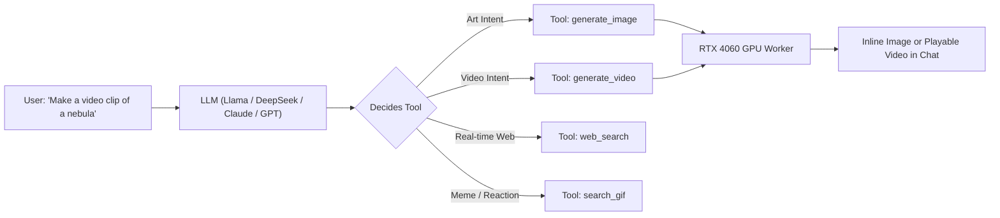

# ⚡ NEXUSROUTE // LOCAL GPU STUDIO COMMAND CENTER ⚡
> **High-Performance RTX 4060 Local Diffusion, Video Synthesis & Autonomous Agent Gateway**

---


```text
███╗   ██╗███████╗██╗   ██╗██╗   ██╗███████╗    ██████╗  ██████╗ ██╗   ██╗████████╗███████╗
████╗  ██║██╔════╝╚██╗ ██╔╝██║   ██║██╔════╝    ██╔══██╗██╔═══██╗██║   ██║╚══██╔══╝██╔════╝
██╔██╗ ██║█████╗   ╚████╔╝ ██║   ██║███████╗    ██████╔╝██║   ██║██║   ██║   ██║   █████╗  
██║╚██╗██║██╔══╝    ╚██╔╝  ██║   ██║╚════██║    ██╔══██╗██║   ██║██║   ██║   ██║   ██╔══╝  
██║ ╚████║███████╗   ██║   ╚██████╔╝███████║    ██║  ██║╚██████╔╝╚██████╔╝   ██║   ███████╗
╚═╝  ╚═══╝╚══════╝   ╚═╝    ╚═════╝ ╚══════╝    ╚═╝  ╚═╝ ╚═════╝  ╚═════╝    ╚═╝   ╚══════╝
                     🎨 LOCAL GPU ART & VIDEO PROMPT CHEATSHEET 🎬
```

---

## 🚀 Quick-Fire In-Chat Slash Commands
Type these directly into the bottom chat box. They bypass LLM conversation delays and immediately fire up your **RTX 4060 GPU**!

| Command | Aliases | Description | Typical Speed |
| :--- | :--- | :--- | :--- |
| **`/art <prompt>`** | `/image`, `/draw` | Generates a studio illustration & displays image in chat | **~0.28s - 1.5s** |
| **`/video <prompt>`** | `/clip`, `/morph` | Synthesizes a motion video clip with audio into chat | **~2.1s - 3.5s** |
| **`/help`** | `/commands`, `/shortcuts` | Pops up the interactive visual command card in chat | **Instant (0ms)** |

---

## 🎨 In-Chat Art Prompting (`/art`)
You can use natural language or photography and concept art keywords.

### 🌟 Art Prompt Examples
* `/art futuristic cyberpunk street in neo-tokyo with rain reflections and neon signs, 8k render, octane render`
* `/art majestic golden eagle soaring above snow-capped mountain peaks at golden hour, photorealistic, sharp focus`
* `/art cozy retro anime coffee shop in autumn, studio ghibli style, warm lighting, watercolor textures`
* `/art hyperdetailed astronaut sitting on a crater rim on mars looking at earth, cinematic lighting, 4k wallpaper`

### 💡 Pro Tips for `/art`
* **Lighting Keywords**: Add `cinematic lighting`, `volumetric god rays`, `neon rim light`, `soft golden hour`.
* **Rendering Style**: Add `photorealistic`, `unreal engine 5 render`, `vintage polaroid 1980s`, `retro synthwave art`.
* **Detail Boosters**: `intricate textures`, `sharp focus`, `masterpiece, 8k resolution`.

---

## 🎬 In-Chat Video Prompting (`/video`)
NexusRoute creates real motion sequences locally using your RTX 4060 GPU, complete with an **auto-generated procedural synth soundtrack** muxed into a playable MP4!

### 🌟 Video Prompt Examples
* `/video slow cinematic camera pan over a neon cyberpunk city skyline at night`
* `/video 60fps 6s hyperdrive warp jump through a swirling starfield and purple nebula`
* `/video sdxl glowing bioluminescent jellyfish floating through midnight deep ocean currents`
* `/video wan cinematic dragon emerging from volcanic clouds in high fantasy realm`
* `/video ltx aerial drone flyover of ancient futuristic ruins in dense jungle`
* `/video realvis time-lapse of a crimson orchid blooming in morning sunlight`

### ⚡ Power Modifiers & Shortcuts (Combine in any order!)
* **Engine / Model**:
  * `wan` -> Alibaba Wan 2.1 Video DiT (1.3B)
  * `ltx` -> Lightricks LTX-Video 2B Fast DiT
  * `cogvideo` -> THUDM CogVideoX-2B High-Definition DiT
  * `sdxl` -> Stable Diffusion XL 1.0 High-Definition
  * `realvis` -> RealVisXL V5.0 Ultra-Photorealistic Cinema
  * `turbo` (default) -> SD-Turbo Real-Time Latent Morph (0.2s/frame)
* **Framerate**: `60fps` (default) or `30fps` or `24fps`
* **Duration**: `3s`, `6s`, `10s`, or `12s`
* *Example*: `/video 60fps 6s wan cinematic dragon emerging from volcanic clouds in high fantasy realm`

### 💡 Pro Tips for `/video`
* **Describe Camera Movement**: Words like `camera pan left`, `slow forward zoom`, `aerial flyover`, `orbit shot` guide motion synthesis.
* **Describe Natural Dynamics**: Words like `flowing`, `rippling water`, `flickering embers`, `swirling smoke`, `drifting clouds` give high motion contrast.
* **Built-in Audio & FLAC Import**:
  * Every video automatically synthesizes stereo synthwave audio!
  * You can upload your own **lossless `.flac`**, `.wav`, or `.mp3` tracks in the Video Studio modal (up to 150MB). The engine automatically trims and fades your custom track to match the video runtime.
* **Format & Timing**: Render at 60 FPS in 1:1 square, 16:9 cinematic widescreen, or 9:16 vertical TikTok format.

---

## 🛠️ Autonomous AI Agent Tools (The 🛠️ Toggle)
When the **🛠️ Tools** button next to your chat bar is active, the AI assistant can invoke tools on its own!



### 1. `generate_video`
* **What it does**: Allows the AI to autonomously create video clips when you chat with it.
* **Trigger prompts**:
  * *"Can you animate a quick clip of a comet passing Earth?"*
  * *"Create a video of a robot dancing in the rain."*
* **Outputs**: An interactive, full-color `<video controls autoplay loop>` player embedded inside the AI's response with an **⬇️ MP4 Download** button.

### 2. `generate_image`
* **What it does**: Paints artwork directly on your local GPU.
* **Trigger prompts**:
  * *"Draw a concept art sketch of a floating castle."*
  * *"Paint a portrait of a viking warrior in battle."*
* **Outputs**: Studio artwork card with one-click full-screen zoom and file download.

### 3. Coding & Verification Tools
* `write_file` / `patch_file` / `read_file` / `list_directory`: Full workspace software engineering.
* `execute_command`: Run powershell / npm / git commands.
* `test_html_app`: Headless Playwright UI test runner that loads built webapps, clicks buttons, and verifies zero console errors!

### 4. `web_search` & `search_gif`
* Search real-time web articles or find Giphy reaction memes on the fly.

---

## 🛡️ Workspace Sandboxing & Instant Desktop Shield

Autonomous models can occasionally attempt to dump test scripts or scratch files directly onto your Windows Desktop. NexusRoute prevents this with defense-in-depth safeguards:

* 🛡️ **Workspace Sandbox (`./workspace`)**: File writes are strictly confined to the workspace directory by default. Path traversal attacks (`../../`) throw immediate security exceptions.
* 🛡️ **Instant Desktop Shield (`blockDesktopAccess`)**: Even in Trusted mode, writes to `C:\Users\<User>\Desktop` are blocked by default. You can designate any specific folder in the Studio.
* 🛡️ **Windows System Directory Lock**: `C:\Windows`, `System32`, and sensitive system paths are permanently locked under all configurations.

---

## ⚙️ System Prompts & Rules Studio (PIN: `1111`)

Click **⚙️ Prompts & Rules** in the top navigation bar to access the control studio. Protected by PIN `1111` so friends or guests cannot tamper with routing:

* 🔀 **Provider Cascade Reordering**: Adjust fallback priority order using **▲** and **▼** buttons. Choose presets: *Fast Coding*, *Max Quality*, *Free First*, or *Local GPU First*.
* 🎭 **Personas & Roaster Mode**: Toggle default personas or activate the **Universal Roast Master** for hilarious, sharp code feedback.
* ⏱️ **Turn & Timeout Limits**: Configure maximum autonomous agent turns (default: 25) and cloud timeouts.
* 🔄 **One-Click Factory Reset**: Instantly restore default prompts, cascades, and sandboxing rules.

---

## 🖥️ Native Windows Desktop Host (`NexusRoute.exe`)

NexusRoute includes a high-performance native desktop host built in C# / .NET 9.

### 📍 Taskbar System Tray Menu (Bottom-Right Corner)
Right-clicking the green ⚡ icon in the taskbar tray provides one-click options:
* **🌐 Open Nexus Studio**: Launch the web interface at `http://127.0.0.1:3000`.
* **📁 Open Workspace Folder**: Open `./workspace` in Windows File Explorer.
* **⚙️ Prompts & Rules Studio**: Open the PIN-protected configuration panel.
* **🔄 Restart Gateway**: Recycle the Fastify server without closing the desktop app.
* **📊 Gateway & GPU Status**: Display a Windows notification bubble with live port & VRAM metrics.
* **❌ Exit NexusRoute**: Clean kernel process shutdown terminating all child node/python/ollama workers.

### ⚡ CLI Flags & Automation
* `NexusRoute.exe`: Standard launch (starts gateway, tray icon, and opens browser).
* `NexusRoute.exe --tray`: Start minimized to system tray without browser popup.
* `NexusRoute.exe --headless`: Silent background API mode for Claude Code / Cursor / Aider.
* `NexusRoute.exe --port <p>`: Custom port (e.g. `--port 8080`).
* `NexusRoute.exe --stop`: Cleanly terminate running instances.

### 📦 Building & Sharing with Friends
* `npm run build:exe`: Compile TypeScript, bundle web assets, and build `NexusRoute.exe`.
* `npm run build:exe:selfcontained`: Generate standalone binary with embedded .NET (zero prerequisites).
* `npm run package:portable`: Assemble portable release in `release/NexusRoute-Portable/` ready to zip.

---

## 🎹 Procedural Audio Synth Engine
NexusRoute doesn't just make silent video—it has a built-in multi-layer procedural synthesizer:

| Vibe | Instrument Profile | BPM | Scale |
| :--- | :--- | :--- | :--- |
| **`synthwave`** | Analog chorus pads, punchy kick, retro hi-hats | 118 | D-Minor (Dark Synth) |
| **`cyberpunk`** | Distorted bassline, sawtooth lead, metallic snare | 128 | Industrial Phrygian |
| **`orchestral`** | Staccato cello pulses, low contrabass foundation | 90 | Cinematic Minor |
| **`phonk`** | 808 sub-bass slide, rolling trap hi-hats | 135 | Drift Pentatonic |
| **`ambient`** | Cosmic sine drone, evolving filter sweeps, no drums | Free | Space Open |

---

## ⌨️ Universal Keyboard Shortcuts

| Shortcut | Action |
| :--- | :--- |
| <kbd>Enter</kbd> | Send current prompt / Execute slash command |
| <kbd>Shift</kbd> + <kbd>Enter</kbd> | Insert multiline newline without submitting |
| <kbd>Ctrl</kbd> + <kbd>V</kbd> | Paste screenshot directly from Windows clipboard into chat |
| <kbd>Esc</kbd> | Stop streaming generation / Cancel active GPU render |
| <kbd>Alt</kbd> + <kbd>Enter</kbd> | Trigger voice dictation microphone (Speech-to-Text) |

---

## 🗂️ Where Media Is Stored
All your creations are automatically saved in high resolution:
* 🖼️ **Art & Illustrations**: `scratch/nexus-route/workspace/art/*.png`
* 🎬 **Video Clips & Animations**: `scratch/nexus-route/workspace/art/*.mp4`
* 📸 **Screenshots & Vision**: `scratch/nexus-route/workspace/screenshots/*.png`
* 🎭 **Face Lock References**: `scratch/nexus-route/workspace/face_references/*.png`

You can access any file in your browser at:
`http://127.0.0.1:3000/v1/workspace/files/art/<filename>`

---

*Enjoy prompting local art and video right in your NexusRoute chat!* 🚀✨
