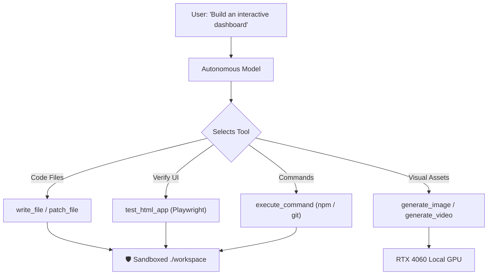

# ⚡ NexusRoute: High-Performance AI Routing Gateway & Windows Desktop Studio

[](https://microsoft.com/windows)
[](https://dotnet.microsoft.com/)
[](https://fastify.dev/)
[](https://nvidia.com)
[](http://localhost:3000/v1)
[](LICENSE)

```text
███╗   ██╗███████╗██╗   ██╗██╗   ██╗███████╗    ██████╗  ██████╗ ██╗   ██╗████████╗███████╗
████╗  ██║██╔════╝╚██╗ ██╔╝██║   ██║██╔════╝    ██╔══██╗██╔═══██╗██║   ██║╚══██╔══╝██╔════╝
██╔██╗ ██║█████╗   ╚████╔╝ ██║   ██║███████╗    ██████╔╝██║   ██║██║   ██║   ██║   █████╗  
██║╚██╗██║██╔══╝    ╚██╔╝  ██║   ██║╚════██║    ██╔══██╗██║   ██║██║   ██║   ██║   ██╔══╝  
██║ ╚████║███████╗   ██║   ╚██████╔╝███████║    ██║  ██║╚██████╔╝╚██████╔╝   ██║   ███████╗
╚═╝  ╚═══╝╚══════╝   ╚═╝    ╚═════╝ ╚══════╝    ╚═╝  ╚═╝ ╚═════╝  ╚═════╝    ╚═╝   ╚══════╝
```

> **NexusRoute** is a zero-bloat, high-performance AI routing gateway, local GPU synthesis engine, and native Windows desktop application. It unifies frontier cloud models (OpenAI, Anthropic, Gemini, xAI, DeepSeek) with local GPU acceleration (RTX 4060 / Ollama / SDXL / Wan 2.1 / LTX-Video / CogVideoX) through a single drop-in OpenAI-compatible endpoint.

---

## 🌟 Key Highlights

- 🖥️ **Native Windows Desktop Host (`NexusRoute.exe`)**: Starts in milliseconds, sits silently in your Windows system tray, and guarantees clean process shutdown with zero orphaned processes.
- ⚡ **Instant Slash Commands**: Type `/art` or `/video` directly in chat for rapid local GPU media creation with procedural stereo audio synthesis.
- 🔀 **Smart Resilience & Automatic Cascading**: Never see a 429 or 503 error again. Cascades across upstream providers seamlessly with circuit breakers.
- 🛡️ **Autonomous Agent Tools with Desktop Shield**: Built-in coding tools (`write_file`, `patch_file`, `test_html_app`), sandboxed to `./workspace` with an **Instant Desktop Shield** to keep your desktop and system files safe.
- ⚙️ **Prompts & Rules Studio (PIN: `1111`)**: Lock and customize provider cascade orders, persona rules, roaster modes, and turn timeouts.
- 📦 **One-Click Packaging for Friends**: Distribute as a portable folder or standalone `.exe` with zero installation steps required.

---

## 🖥️ Native Windows Desktop Host (`NexusRoute.exe`)

NexusRoute includes a dedicated Windows desktop host built in C# / .NET 9. It runs directly on your machine without heavy webview or Electron overhead.

### 📍 System Tray Menu (Bottom-Right Taskbar)

When `NexusRoute.exe` is running, a green ⚡ icon appears in your Windows system tray. Right-clicking the icon opens the native control center:

| Menu Option | Action |
| :--- | :--- |
| **🌐 Open Nexus Studio** | Launches the web playground in your default browser at `http://127.0.0.1:3000` |
| **📁 Open Workspace Folder** | Opens the active sandboxed folder (`./workspace`) in Windows File Explorer |
| **⚙️ Prompts & Rules Studio** | Opens the PIN-protected configuration studio directly in your browser |
| **🔄 Restart Gateway** | Hot-cycles the Fastify backend without restarting the desktop application |
| **📊 Gateway & GPU Status** | Pops a Windows notification bubble with live port status, PID, and GPU VRAM usage |
| **❌ Exit NexusRoute** | Terminated cleanly using Windows Kernel Job Objects—guaranteeing zero zombie processes |

### ⚡ Under the Hood: Zero Leaks & High Performance

- **Instant Startup**: Launches in under 150ms—no Electron or Chromium wrappers required.
- **Single-Instance Mutex (`Global\NexusRoute_SingleInstance_Mutex_3000`)**: Prevents duplicate instances from conflicting on port 3000. Launching a second instance simply brings the existing window or tray to the foreground.
- **Kernel Job Object Isolation**: The native host assigns all child processes (Node.js backend, Ollama, Python GPU workers) to a Windows Kernel Job Object with `JOB_OBJECT_LIMIT_KILL_ON_JOB_CLOSE`. When you click Exit, **every sub-process is instantly and cleanly closed**, leaving no lingering background processes or VRAM allocations.

### 💻 Command-Line Flags & Headless Automation

You can run `NexusRoute.exe` via PowerShell, Command Prompt, or desktop shortcuts:

```powershell
# Standard run: starts gateway, docks to tray, opens browser
.\NexusRoute.exe

# Start minimized to system tray only (no browser popup)
.\NexusRoute.exe --tray

# Run silently as a background API service (perfect for Claude Code, Cursor, Aider, or CI/CD)
.\NexusRoute.exe --headless

# Override port (default is 3000)
.\NexusRoute.exe --port 8080

# Cleanly stop any active background instance
.\NexusRoute.exe --stop
```

---

## 🚀 Quick-Fire In-Chat Slash Commands

NexusRoute features built-in chat shortcuts that bypass LLM delays to execute directly on your **RTX 4060 GPU** or render utilities.

| Command | Aliases | Description | Speed |
| :--- | :--- | :--- | :--- |
| **`/run <cmd>`** | `/exec`, `$ <cmd>`, direct CLI (`npm`, `git`, `dotnet`) | Executes terminal commands live with real-time streaming console | **Real-time SSE** |
| **`/art <prompt>`** | `/image`, `/draw` | Generates a studio illustration on local GPU | **~0.28s – 1.5s** |
| **`/video <prompt>`** | `/clip`, `/morph` | Synthesizes an MP4 motion clip with procedural stereo audio | **~2.1s – 3.8s** |
| **`/help`** | `/commands`, `/shortcuts` | Prints the interactive Command Center cheatsheet card in chat | **Instant (0ms)** |

> 💡 **Tip:** You can also click the **❓ Help** button in the top navigation bar anytime to open the full 6-tab modal guide. Type commands like `npm run build:exe:selfcontained` or `npm test` directly into the chat bar to execute them live!

### 🎨 Local GPU Art Generation (`/art`)

Supports natural language and concept art keywords:
```text
/art futuristic cyberpunk street in neo-tokyo with neon reflections and rain, 8k render, octane render
/art majestic golden eagle soaring above snow-capped mountain peaks at sunset, photorealistic
/art cozy retro anime coffee shop in autumn, studio ghibli style, warm watercolor lighting
```

### 🎬 Video DiT Motion Engines (`/video`)

NexusRoute generates motion clips locally and muxes a synchronized procedural synthwave soundtrack into playable MP4s. Prefix keywords in your prompt to choose engines, framerates, or durations:

```text
/video 60fps 6s wan cinematic dragon emerging from volcanic clouds in a fantasy realm
/video ltx aerial drone flyover of ancient futuristic ruins deep in the jungle
/video cogvideo slow cinematic camera pan over a neon cyberpunk city skyline at night
/video 60fps 3s sdxl glowing bioluminescent jellyfish floating through deep midnight ocean
/video realvis time-lapse of a crimson orchid blooming in morning sunlight
```

#### ⚡ Engine & Modifier Reference:
- **`wan`** — Alibaba Wan 2.1 Video DiT (1.3B)
- **`ltx`** — Lightricks LTX-Video 2B Fast DiT
- **`cogvideo`** — THUDM CogVideoX-2B High-Definition DiT
- **`sdxl`** — High-Definition SDXL Latent Morph
- **`realvis`** — RealVisXL V5.0 Ultra-Photorealistic Cinema
- **`turbo`** *(default)* — SD-Turbo Real-Time Latent Morph (0.2s/frame)
- **Framerate**: `60fps` *(default)*, `30fps`, `24fps`
- **Duration**: `3s`, `6s`, `10s`, `12s`
- 📸 **Photo-to-Video Animation**: Paste or attach any photo in chat, then type:
  ```text
  /video animate this photo camera pan left
  ```

### 💻 In-Chat Terminal Execution Runner (`/run`, `$`, or direct CLI)

NexusRoute turns your chat input into an interactive live developer console. You don't need to switch between the browser and a terminal window:

- **Direct CLI Execution**: Simply type commands like `npm run build:exe:selfcontained`, `npm test`, or `git status` into the chat box and hit <kbd>Enter</kbd>.
- **Prefix Shortcuts**: Prefix any command with `/run <cmd>`, `/exec <cmd>`, or `$ <cmd>` (e.g. `$ dir`, `/run dotnet --version`).
- **Live Real-time SSE Stream**: Output streams chunk-by-chunk into an inline dark monospace terminal card with syntax formatting.
- **Process Management**: Includes a live elapsed timer, a `⏹️ Stop` button to kill runaway processes, a `📋 Copy Output` button, and a `🔄 Re-run` button.

---

## 🛠️ Autonomous AI Agent Tools & 🛡️ Instant Desktop Shield

Toggle the **🛠️ Tools** switch next to the chat bar to enable models (such as Claude 3.5 Sonnet, GPT-4o, DeepSeek, Qwen) to autonomously execute real-world development tasks.



### Built-in Agent Tools

| Category | Tool | Description |
| :--- | :--- | :--- |
| **Files** | `write_file` | Create or overwrite files within the designated workspace |
| **Files** | `read_file` | Inspect project source files, configurations, or logs |
| **Files** | `patch_file` | Surgical block replacement with diff verification |
| **Files** | `list_directory`| Traverse workspace directories and inspect file trees |
| **Execution** | `execute_command` | Execute commands (powershell, npm, git) inside the workspace |
| **Execution** | `test_html_app` | Headless Playwright UI test verifying zero console errors and button clicks |
| **Creativity** | `generate_image` | Autonomous art rendering on local RTX 4060 |
| **Creativity** | `generate_video` | Autonomous video clip synthesis with audio muxing |
| **Intelligence**| `web_search` | Real-time web retrieval for current documentation and news |
| **Reactions** | `search_gif` | Search and embed animated Giphy reaction memes |
| **Math** | `calculator` | Exact precision floating-point evaluation |

### 🛡️ Sandboxing & Instant Desktop Shield

Autonomous models can occasionally be unpredictable and attempt to scatter output files across your home directory or Desktop. NexusRoute enforces strict defense-in-depth safety:

1. **Sandboxed Workspace Mode (Safe Default)**: All file modifications (`write_file`, `patch_file`) are strictly confined to the project workspace (default: `./workspace`). Path traversal attempts (`../../`) trigger an immediate `SecurityError`.
2. **Instant Desktop Shield (`blockDesktopAccess`)**: Even in Trusted mode, writes targeting `C:\Users\<User>\Desktop` are blocked by default. Your desktop remains clean.
3. **Custom Folder Designation**: Pick or name any specific folder (e.g., `./projects`, `./my-app`) directly from the Prompts & Rules Studio.
4. **OS Protection Guard**: System paths (`C:\Windows`, `System32`, `Program Files`) are permanently blocked under all configurations.

---

## ⚙️ System Prompts & Rules Studio (PIN: `1111`)

Click **⚙️ Prompts & Rules** in the top navigation bar to access the control studio. Protected by PIN `1111` to prevent accidental changes when sharing your PC with friends or team members.

- **🔀 Provider Cascade Reordering**: Customize the exact failover order with **▲** and **▼** buttons.
  - **Fast Coding Preset**: Prioritizes low-latency models (Groq, Claude Haiku, GPT-4o-mini).
  - **Max Quality Preset**: Prioritizes top reasoning engines (Claude 3.5 Sonnet, GPT-4o, DeepSeek R1).
  - **Free First Preset**: Uses free-tier allowances (Gemini, Groq, OpenRouter) before paid credits.
  - **Local GPU First Preset**: Keeps requests entirely on your local machine (Ollama / vLLM / RTX 4060).
- **🎭 Personas & Roaster Mode**: Toggle default personas (Senior Architect, Creative Director, Cyberpunk Terminal) or activate **Universal Roast Master** for witty, insightful code critiques.
- **⏱️ Turn & Timeout Controls**: Limit maximum agent turns (default: 25) and cloud request timeouts.
- **🔄 One-Click Factory Reset**: Instantly restore safe sandbox permissions, default cascade order, and stock prompts.

---

## 📦 Building & Sharing with Friends

Want to give NexusRoute to friends without making them set up developer environments? Everything can be bundled with single commands:

```powershell
# 1. Full Build (compiles TypeScript, bundles web assets, builds NexusRoute.exe)
npm run build:exe

# 2. Standalone Build (embeds .NET runtime inside the .exe - zero prereqs for friends!)
npm run build:exe:selfcontained

# 3. Assemble Portable Release Folder (creates release/NexusRoute-Portable/)
npm run package:portable
```

### Distributing the Portable Package:
After running `npm run package:portable`, zip up the generated `release/NexusRoute-Portable/` folder and send it over. Your friends can simply:
1. Extract the zip.
2. Double-click `NexusRoute.exe`.
3. The server starts instantly in their system tray and opens the Studio in their browser!

---

## 🔌 Quick Start & Client Connection Guides

NexusRoute provides full drop-in compatibility with the standard OpenAI API at `http://localhost:3000/v1`.

### Python OpenAI SDK
```python
from openai import OpenAI

client = OpenAI(
    base_url="http://localhost:3000/v1",
    api_key="none"  # Handled by NexusRoute locally
)

response = client.chat.completions.create(
    model="auto",  # Or "fast", "reasoning", "coding", "local"
    messages=[{"role": "user", "content": "Explain quantum computing in 3 sentences."}],
    stream=True
)

for chunk in response:
    content = chunk.choices[0].delta.content
    if content:
        print(content, end="", flush=True)
```

### Node.js / TypeScript OpenAI SDK
```typescript
import OpenAI from "openai";

const client = new OpenAI({
  baseURL: "http://localhost:3000/v1",
  apiKey: "none"
});

const stream = await client.chat.completions.create({
  model: "auto",
  messages: [{ role: "user", content: "Write a quick debounce function in TypeScript." }],
  stream: true
});

for await (const chunk of stream) {
  process.stdout.write(chunk.choices[0]?.delta?.content || "");
}
```

### Cursor & VS Code
In Cursor / Continue settings:
- **Base URL**: `http://localhost:3000/v1`
- **API Key**: `nexus` (any non-empty string)
- **Model**: `auto`, `fast`, or `coding`

### cURL
```bash
curl -X POST http://localhost:3000/v1/chat/completions \
  -H "Content-Type: application/json" \
  -d '{
    "model": "auto",
    "messages": [{"role": "user", "content": "Hello NexusRoute!"}],
    "stream": true
  }'
```

---

## ⌨️ Universal Keyboard Shortcuts

| Shortcut | Action | Scope |
| :--- | :--- | :--- |
| <kbd>Enter</kbd> | Send current prompt or execute slash command | Chat input |
| <kbd>Shift</kbd> + <kbd>Enter</kbd> | Insert multiline newline without sending | Chat input |
| <kbd>Ctrl</kbd> + <kbd>V</kbd> | Paste screenshot from Windows clipboard into chat | Global |
| <kbd>Esc</kbd> | Close active modal / Stop current streaming response | Global |
| <kbd>F11</kbd> | Toggle Fullscreen Zen Mode | Global |
| <kbd>Alt</kbd> + <kbd>Enter</kbd> | Toggle Voice Dictation (Speech-to-Text) | Global |

---

## 🗂️ File System & Media Storage

All media generated by slash commands or autonomous agents are saved in high resolution:
- 🖼️ **Art & Illustrations**: `workspace/art/*.png`
- 🎬 **Video Clips & Animations**: `workspace/art/*.mp4`
- 📸 **Attached Screenshots**: `workspace/screenshots/*.png`
- 🎭 **Face Lock References**: `workspace/face_references/*.png`

Direct browser access: `http://127.0.0.1:3000/v1/workspace/files/art/<filename>`

---

## 🧪 Testing & Verification

Run the full automated test suite (including failover circuit breaker tests and chaos simulation):
```powershell
npm test
```

---

## 📄 License
MIT License. Free for personal, academic, and commercial use.
